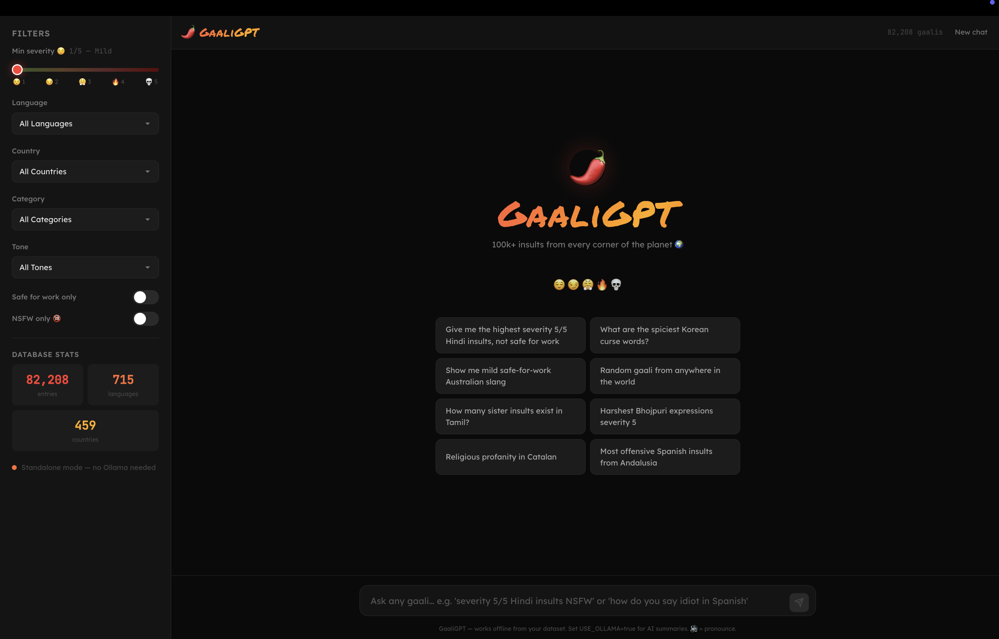
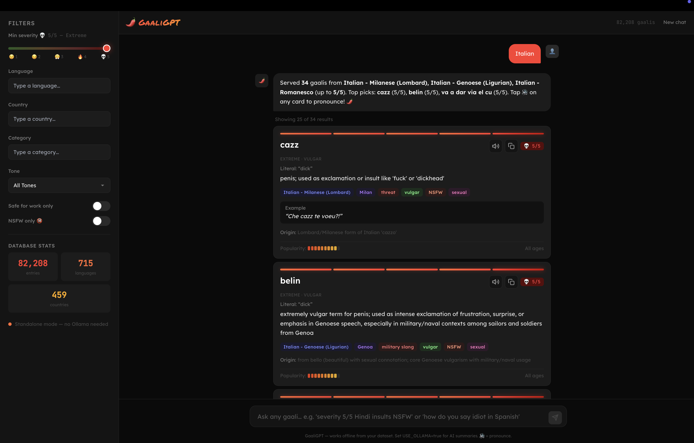

# ProfanityBench

**The most comprehensive open multilingual profanity benchmark ever assembled — hate speech flags, dialects, tones, generational slang, etymology, and severity you can actually search.**

The runnable chat app in this repo is **[GaaliGPT](http://localhost:3000)** (the UI name). **ProfanityBench** is the project, dataset, and community around it.

Search **82,000+** curse words, insults, and slang from hundreds of languages and dialects. **No frontier LLM required** — inverted-index search, intent parsing, and insult-aware ranking run locally in milliseconds. Optional tiny models (e.g. `llama3.2:1b`) only polish summaries if you want them.

> **This project is not perfect — but it's already great.** Severity ratings, dialect labels, and cultural nuance will always need human eyes. That's why we want *you* to contribute, verify, and argue about the data. That's the point.

<p align="center">
  
  
</p>

---

## Search without a powerful LLM

**You do not need GPT-4, Claude, or a GPU cluster to use ProfanityBench productively.**

GaaliGPT's core value is **structured retrieval over a richly annotated corpus**:

- **Inverted index** over language, country, category, tone, severity, NSFW/SFW, hate-speech flags, and text fields — sub-millisecond filter passes on ~82k rows
- **Intent parsing** — natural queries like *"severity 5 Hindi insults NSFW"* or *"highest in Italian"* map to precise filters without an LLM
- **Insult-aware ranking** — real slurs surface above prison slang, drug terms, and false positives (e.g. Hindi *andar* when you asked for gaalis)
- **Language families** — pick `Italian` and get `Italian - Standard`, `Italian - Romanesco`, and every dialect label in the data
- **Strict language modes** — e.g. `Hindi` only, without Hinglish register noise

A **small local model** (`llama3.2:1b`, `phi3:mini`, `gemma2:2b`) is **optional** and off by default (`USE_OLLAMA=false`). When enabled, it only rewrites a short intro from search hits you already have — it does not decide what matched. For moderation pipelines, research exports, and game chat filters, **the JSONL + search layer is the product**; a 1B model should be more than enough for light personalization if you want it at all.

**Bottom line:** ship trust & safety, localization QA, and academic sampling on **search + schema**, not on burning tokens.

---

## What makes this dataset different

ProfanityBench is built to be the **deepest openly searchable profanity corpus** — not a flat word list.

| Dimension | What you get |
|-----------|----------------|
| **Languages & dialects** | Hundreds of labels including regional variants (`Italian - Romanesco`, diaspora registers, script variants) |
| **Hate speech** | Explicit `hate_speech` flags plus category/tone context for legal and safety workflows |
| **Severity (1–5)** | Calibrated offensiveness scale; community-verified via [`scripts/fix_severity.py`](scripts/fix_severity.py) |
| **Tone** | mild, harsh, vulgar, playful, etc. — drives ranking and moderation thresholds |
| **Generation** | `all`, `Gen Z`, `boomer`, and generational slang metadata |
| **Taxonomy** | Rich `category` (kinship insults, body, religion, class, prison slang, …) |
| **Content flags** | `safe_for_work`, `sexual`, `religious`, `family_related`, composite toxicity signals |
| **Etymology & meaning** | `literal_translation`, `actual_meaning`, `etymology`, `notes`, example sentences |
| **Popularity** | `popularity_score` for ranking culturally salient terms |
| **Geography** | `country`, `region` for market-specific moderation |

No other open resource combines **scale (~82k entries)**, **multilingual dialect coverage**, **hate-speech annotation**, **generational tags**, and **a ready-made search UI** in one place.

---

## Branding

| Where | Name |
|-------|------|
| **Repo, README, PRs, community** | **ProfanityBench** |
| **App UI** (header, chat, assistant persona) | **GaaliGPT** |

Same project — ProfanityBench is the benchmark and dataset; GaaliGPT is what users see when they run the app.

---

## Quick start

```bash
git clone git@github.com:NileshArnaiya/ProfanityBench.git
cd ProfanityBench
npm install
cp .env.example .env
npm run dev
```

Open [http://localhost:3000](http://localhost:3000).

### Dataset

Point `GAALI_DATA_PATH` in `.env` to your JSONL file (default: `./data/gaalis.jsonl`). We also ship `data/dataset.jsonl` (~82k entries). One JSON object per line.

### Ollama (optional — not required)

The app runs **without any LLM** by default (`USE_OLLAMA=false`). Search, filters, pronunciation (browser TTS), and result cards work fully offline.

To enable optional AI-written summaries from search results:

```bash
ollama pull llama3.2:1b
# In .env:
USE_OLLAMA=true
OLLAMA_MODEL=llama3.2:1b
```

A **small** model is intentional: search already did the hard work. Try `phi3:mini`, `gemma2:2b`, etc. and open a PR with what worked best for your language.

---

## Using the app

| Feature | How |
|--------|-----|
| **Chat** | Ask naturally: *"severity 5 Hindi insults NSFW"*, *"highest in Italian"*, *"how do you say idiot in Spanish"* |
| **Filters** | Searchable language / country / category fields — type to find values in long lists |
| **Severity** | Slider defaults to **5/5 (maximum)** — lower it for milder browsing |
| **Pronounce** | Tap the speaker icon on any result card |
| **Browse** | Set filters only, then use *Browse with your filters* |

Sidebar filters stack with your query. Language filters use smart matching: picking **Italian** includes `Italian - Standard`, `Italian - Romanesco`, etc.

---

## Data analysis notebook

Explore the full **~82k JSONL** with publication-grade EDA:

**[`data/analysis/profanity_analysis.ipynb`](data/analysis/profanity_analysis.ipynb)**

Install deps from the notebook header (`pandas`, `numpy`, `matplotlib`, `seaborn`, `scipy`, `scikit-learn`; optional `sentence-transformers` for embeddings). Point it at `data/dataset.jsonl` or `data/gaalis.jsonl`.

### What the notebook covers

| Section | Analysis |
|---------|----------|
| **§2–3 Descriptive** | Missing-value audit, duplicates, memory usage, entries per language/script/country, linguistic diversity index, language×script heatmap |
| **§4 Taxonomic** | Category distribution, category×language heatmap, target type and tone breakdowns, category×tone interaction |
| **§5 Severity & toxicity** | Severity histogram, mean severity by category/language (with error bars), boxplots by category and tone, popularity vs severity scatter (Pearson *r*), composite toxicity score (severity + 2×hate + sexual + religious), top-20 most toxic entries |
| **§6 Generational & popularity** | Generation distribution, popularity KDE by generation, generation×category crosstab (%), Gen Z category breakdown, drug-term generational specificity, generation×severity interaction |
| **§7 Content flags** | Boolean flag counts/%, co-occurrence matrix, hate speech by language/category, hate vs non-hate severity violin plot, hate-speech severity paradox (Mann–Whitney *U*) |
| **§8 Etymology** | Source-language extraction (Sanskrit, Arabic, English, …), English loanword host languages, etymology documentation depth |
| **§9 Word-level** | Word length (native + transliteration), mean length by language, meaning/notes length, word clouds, most common literal translations |
| **§10 Semantic clustering** | Sentence-transformer embeddings → K-Means → t-SNE (by cluster and category), elbow method for optimal *K* |
| **§11 Network** | Category co-occurrence across languages, SFW rates by language |
| **§12 Statistical tests** | Correlation matrix, chi-squared (hate×category, generation×category), Kruskal–Wallis (severity~tone, popularity~generation), Spearman correlations |

Dozens of charts and tables — use them for papers, dashboards, or severity QA before you open a PR.

---

## Applications and use cases

A large-scale multilingual profanity dataset unlocks work far beyond the demo app.

### Content moderation and trust & safety

Social platforms (Meta, X, TikTok, Reddit, Snap) need automated filtering across markets they cannot staff with native moderators for every dialect. Gaming (Riot, Activision, Roblox, EA, Tencent) uses it for in-game chat and voice moderation. Live streaming (Twitch, YouTube Live, Kick) needs real-time detection. Dating apps (Tinder, Bumble, Hinge) screen profiles and messages. Children's platforms need age-aware filtering. Community sites (Quora, Stack Exchange, Wikipedia) flag bad-faith edits.

### AI safety and LLM development

Foundation labs need taboo data for RLHF, red-teaming, and refusal training across languages. Multilingual safety classifiers and constitutional-AI checks have a massive non-English blind spot without this coverage. Open evaluators (Hugging Face, EleutherAI) and synthetic adversarial-data vendors benefit from the same schema.

### Translation and localization

Machine translation often **mistranslates insults** — literal renderings lose cultural weight. Game/film/book localization, subtitles (Netflix, Prime), and legal/diplomatic tools need register-aware equivalents and honor-culture insult detection.

### Sociolinguistic and academic research

Linguistics (taboo evolution, pragmatics), anthropology (honor vs shame cultures, kinship insults), computational cross-lingual alignment, gender studies (misogynistic patterns), caste/class/ethnicity slur tracking, historical borrowing (e.g. Persian → Hindi → Bengali chains).

### Law enforcement and legal tech

Cyberbullying detection, hate-crime classification (expert testimony on whether a term qualifies under local law), workplace harassment evidence, stalking/threat assessment, forensic linguistics, election harassment monitoring.

### EdTech and language learning

Teach learners what to avoid (Duolingo, Babbel, heritage learners, expat cultural-fluency, ESL for moderators, travel warnings for severe insults).

### Customer support and CRM

Abusive call-center detection, angry-user chatbot training, brand sentiment, hostile ticket triage, SMS harassment filtering.

### Cybersecurity and investigations

Extremist forum monitoring, OSINT radicalization tracking, coordinated harassment vocabularies, brand protection, doxxing/swatting prevention.

### Advertising and brand safety

Ad-placement brand safety (DoubleVerify, IAS), global product-name screening (infamous cross-market naming fails), influencer vetting, sponsorship risk.

### Healthcare and mental health

Crisis lines routing on escalating language, bullying victimization signals, domestic-violence pattern detection, therapy-platform crisis flags.

### Government, regulation, and civil society

Election hate-speech monitoring, DSA / India's IT Rules / UK Online Safety Act audits, NGO harassment documentation (journalists, activists), UN incitement tracking, refugee-targeted harassment.

### Entertainment, media, and publishing

Authentic dialogue, comedy market calibration, game NPC trash talk, news printability, sensitivity readers, documentary handling of source material.

### Speech and voice technology

ASR profanity vocabularies (Alexa, Siri, Google Assistant), TTS refusal lists, voice-cloning misuse detection, call-recording compliance.

### HR tech and workplace tools

Enterprise chat moderation (Slack, Teams), harassment reporting platforms, D&I analytics (ethically deployed), tone analysis.

**ProfanityBench gives you one JSONL and one search stack for all of the above** — export slices by language, severity, hate flag, or generation without re-scraping the web.

---

## Contributing — we need you

**The dataset is the product.** The app is the engine. We need help to:

1. **Verify entries** — Is the severity right? Is the meaning accurate? Is the example real?
2. **Fix severity** — Run or improve [`scripts/fix_severity.py`](scripts/fix_severity.py), or hand-edit JSONL. **You are encouraged to change severity** when you know the culture better than a script.
3. **Add missing gaalis** — Regional variants, new internet slang, older generational terms.
4. **Remove or flag bad rows** — Duplicates across dialects are OK; wrong or fake entries are not.
5. **Improve search** — [`src/lib/search.js`](src/lib/search.js): language families, insult relevance ranking, semantic filters.
6. **Extend the analysis notebook** — New sections, reproducible figures, severity QA notebooks.

### How to contribute

1. Fork the repo
2. Edit `data/gaalis.jsonl` and/or `data/dataset.jsonl` (or submit a patch file)
3. Run `python3 scripts/fix_severity.py` if you bulk-change severity
4. Test locally: `npm run dev`
5. Open a **Pull Request** with:
   - What you changed (language/region/count)
   - Why (sources, native speaker, context)
   - How you tested (example queries)

**Meaningful PRs that get merged** — corrections, new languages, severity overhauls, search fixes — **may receive a ProfanityBench T-shirt.** We'll contact you using your GitHub profile.

No PR is too small: one language, one category, ten fixed severities.

---

## Data schema

Each line in the JSONL is one entry:

| Field | Description |
|-------|-------------|
| `id` | Unique ID, e.g. `HI-0000043` |
| `language` | e.g. `Hindi`, `Italian - Romanesco` |
| `country`, `region` | Geographic context |
| `word`, `transliteration` | Term + romanization |
| `literal_translation`, `actual_meaning` | Meaning layers |
| `category`, `tone` | insult type, mild/harsh/vulgar/etc. |
| `severity` | **1–5** (1 = mildest, 5 = nuclear) |
| `safe_for_work`, `sexual`, `religious`, `family_related`, `hate_speech` | Flags |
| `example_sentence`, `etymology`, `notes` | Extra context |
| `popularity_score` | 1–10 for ranking |
| `generation` | `all`, `Gen Z`, `boomer`, etc. |

Example:

```json
{
  "id": "HI-0034003",
  "language": "Hindi",
  "country": "India",
  "word": "बहनचोद",
  "transliteration": "behanchod",
  "literal_translation": "sister-fucker",
  "actual_meaning": "extremely offensive insult",
  "category": "sister-insult",
  "severity": 5,
  "tone": "vulgar",
  "safe_for_work": false,
  "hate_speech": false,
  "popularity_score": 9,
  "generation": "all"
}
```

---

## Project structure

```
ProfanityBench/
├── data/
│   ├── gaalis.jsonl              # default dataset (~79k)
│   ├── dataset.jsonl             # extended copy (~82k)
│   └── analysis/
│       └── profanity_analysis.ipynb
├── screenshots/                  # UI screenshots (README)
├── scripts/
│   └── fix_severity.py           # bulk severity recalibration
├── src/
│   ├── app/api/chat/             # search + response
│   ├── app/api/meta/             # filter options + stats
│   ├── components/
│   │   ├── ChatInterface.jsx
│   │   ├── FilterPanel.jsx
│   │   ├── SearchableSelect.jsx
│   │   └── ResultCard.jsx
│   └── lib/
│       ├── database.js           # JSONL loader + index
│       ├── search.js             # query parser + ranking
│       ├── ollama.js             # optional LLM summaries
│       └── filterDefaults.js
├── .env.example
└── package.json
```

---

## Search & filters (for developers)

- **Strict Hindi** — `language === "Hindi"` only (excludes *Internet Hindi/Hinglish*, etc.)
- **Language families** — Query or filter `Italian` matches all `Italian - *` dialect labels
- **Insult-aware ranking** — Queries mentioning insults/gaalis boost real slurs over prison slang, drug terms, etc.
- **Severity floors** — Query phrases like `5/5`, `highest`, `NSFW` adjust filters automatically
- **Default filter severity** — UI starts at **5/5**
- **No LLM on the critical path** — `/api/chat` returns search hits first; Ollama is a thin optional layer

Improvements welcome: fuzzy matching, contributor-reviewed severity per region, generation/year tags.

---

## Environment

| Variable | Default | Description |
|----------|---------|-------------|
| `GAALI_DATA_PATH` | `./data/gaalis.jsonl` | Path to JSONL |
| `USE_OLLAMA` | `false` | Set `true` for optional LLM summaries |
| `OLLAMA_URL` | `http://localhost:11434` | Ollama API |
| `OLLAMA_MODEL` | `llama3.2:1b` | Small model recommended |
| `OLLAMA_TIMEOUT_MS` | `12000` | Request timeout |

---

## Scripts

```bash
# Recalibrate severity from rules (tone, category, known words)
python3 scripts/fix_severity.py

# Preview without writing
python3 scripts/fix_severity.py --dry-run
```

---

## Roadmap (community-driven)

- [ ] Per-language maintainer teams
- [ ] PR review rubric for severity
- [ ] Better TTS / voice models per language
- [ ] Generation & year metadata (`2020s`, `Gen Alpha`)
- [ ] SQLite / FTS for 500k+ entries
- [ ] Public API for researchers and comedy writers alike
- [ ] Precomputed notebook figures in `data/analysis/outputs/`

---

## License & ethics

This is a **linguistic reference and cultural documentation** project. Use responsibly. Hate speech entries exist in the corpus for accuracy; they are flagged in data. Do not use this to harass people.

Your dataset, your community. **Raise PRs. Fix the severity. Claim your shirt.** 🌶️
